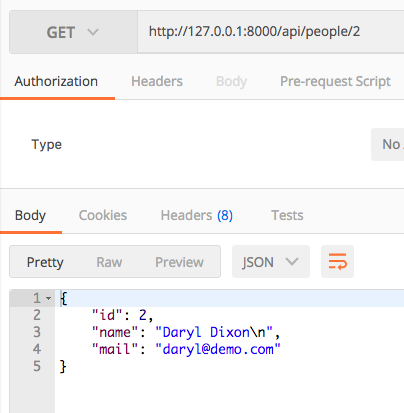
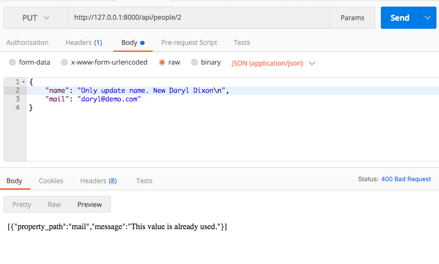

issue-fosrestbundle
===================

PUT Controller - ConstraintViolationList as parameter detect the constraint uniqueEntity - Don't use Form

**Error issue [#1751](https://github.com/FriendsOfSymfony/FOSRestBundle/issues/1751)**

